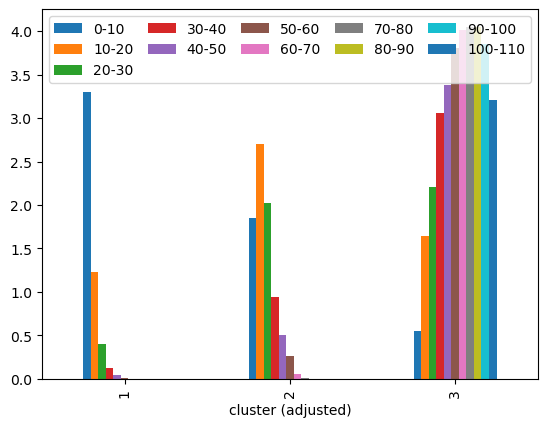

# Elevation and Velocity Clustering in Ria Formosa: assigning elevation and velocity categories to spatial data

## Overview

This project aims to create and assign elevation and velocity categories to polygons representing saltmarsh and seagrass habitats in intertidal zones of Ria Formosa. Therefore, it involves several important steps to achieve our objectives, such as data manipulation and analysis, geospatial analysis and machine learning. The outcome of this project will be used with the purpose of more accurately estimating the blue carbon stocks in Ria Formosa intertidal vegetation habitats according to their different velocity and elevation categories.

## Settings and requirements
The project was built in Python.

### Python packages 
To run this project, ensure that you have the following packages installed in your conda environment:


```python
import rasterio as rio
import geopandas as gpd
import fiona
import pandas as pd
import numpy as np
import scipy
import matplotlib.pyplot as plt
```

## Data

The project utilizes 3 primary data sources:

1. Seagrass and saltmarsh habitats data: a polygon vector data (geopackages) representing seagrass habitats and another polygon vector data representing saltmarsh habitats in Ria Formosa.

2. Digital Elevation Model (DEM) raster, with a resolution of 10 x 10 meters. This dataset was provided by the Portuguese General Directorate for Territory (DG Território).

3. Velocity data:
     - Velocity points coordinates: coordinates of point locations, in which the velocity was previously assessed.
     - Velocity analysis dataset: this is a previously prepared dataset, indicating the frequency of records of each velocity interval in the assessment period, for each point id.


## Velocity clusters
The main steps to obtain velocity categories were:
- Create clusters with the velocity analysis dataset.
- Assign velocity category to points, and export them as geopackage.
- Obtain habitats in 'fishgrid' format.
- Classify each feature from grid into a velocity cluster according to their spatial proximity.

### Creating velocity clusters
The clusters were created using K-Means, which is a popular clustering algorithm that aims to partition a dataset into a predefined number of distinct groups based on the similarity of data points, where each group is represented by its centroid. I choose to create four groups.


```python
from scipy.cluster.vq import kmeans, vq, whiten

# Output
out_clustered = "./clustering_riaformosa/data/velocity_analysis/cluster/velcat_clustered.csv"

# Create list with site_ids, then set it as index
site_id = pd.DataFrame(table_velcat['site_id'])
table_velcat = table_velcat.set_index('site_id')
vel_intervals = table_velcat.columns.tolist()

# Create pandas DataFrame with normalized data (whiten())
velcat_df = pd.DataFrame(whiten(table_velcat))
scaled_intervals = velcat_df.columns

# Add site_id column and set it as idex
velcat_df['site_id'] = site_id
velcat_df = velcat_df.set_index('site_id')

# Create cluster centers and labels
cluster_centers,_ = kmeans(velcat_df, 3, iter=1000, seed = 3)
velcat_df['velcat_raw'],_ = vq(velcat_df, cluster_centers)

# Analyze plots and understand created clusters
# - analyze which has more higher speed counts
velcat_df.groupby('velcat_raw')[scaled_intervals].mean().plot(xlabel = 'cluster (raw)', kind='bar')
plt.legend(vel_intervals, ncol=len(vel_intervals)/2, loc="upper left", mode='expand')
plt.show()

```


    

    


Notice that the clusters have been created, but the numbers of the labels may cause confusion. I want the cluster labels to be in ascending order of velocity: cluster 1 having lowest speed intervals and cluster 4 having the highest.


```python
# Define velocity labels (1 to 3) according to plot 
vel_cats = {0: 1, # lowest  speed
            1: 3, # highest speed
            2: 2, # medium speed
}

# Readjust cluster labels
velcat_df['vel_cat'] = velcat_df['velcat_raw'].replace(vel_cats)

velcat_df.groupby('vel_cat')[scaled_intervals].mean().plot(xlabel = 'cluster (adjusted)', kind='bar')
plt.legend(vel_intervals, ncol=len(vel_intervals)/2, loc="upper left", mode='expand')
plt.show()
```


    

    


```python
velcat_df = velcat_df.drop('velcat_raw', axis=1)
velcat_df.head(5)

# Write csv
#velcat_df.to_csv(out_clustered)

```


<div>
<style scoped>
    .dataframe tbody tr th:only-of-type {
        vertical-align: middle;
    }

    .dataframe tbody tr th {
        vertical-align: top;
    }

    .dataframe thead th {
        text-align: right;
    }
</style>
<table border="1" class="dataframe">
  <thead>
    <tr style="text-align: right;">
      <th></th>
      <th>0</th>
      <th>1</th>
      <th>2</th>
      <th>3</th>
      <th>4</th>
      <th>5</th>
      <th>6</th>
      <th>7</th>
      <th>8</th>
      <th>9</th>
      <th>10</th>
      <th>vel_cat</th>
    </tr>
    <tr>
      <th>site_id</th>
      <th></th>
      <th></th>
      <th></th>
      <th></th>
      <th></th>
      <th></th>
      <th></th>
      <th></th>
      <th></th>
      <th></th>
      <th></th>
      <th></th>
    </tr>
  </thead>
  <tbody>
    <tr>
      <th>saltmarsh_low_01.txt</th>
      <td>2.376178</td>
      <td>2.399437</td>
      <td>1.450511</td>
      <td>0.388183</td>
      <td>0.133014</td>
      <td>0.032786</td>
      <td>0.0</td>
      <td>0.0</td>
      <td>0.0</td>
      <td>0.0</td>
      <td>0.0</td>
      <td>2</td>
    </tr>
    <tr>
      <th>saltmarsh_low_02.txt</th>
      <td>3.846241</td>
      <td>0.319925</td>
      <td>0.000000</td>
      <td>0.000000</td>
      <td>0.000000</td>
      <td>0.000000</td>
      <td>0.0</td>
      <td>0.0</td>
      <td>0.0</td>
      <td>0.0</td>
      <td>0.0</td>
      <td>1</td>
    </tr>
    <tr>
      <th>saltmarsh_low_03.txt</th>
      <td>1.739815</td>
      <td>3.847987</td>
      <td>1.709251</td>
      <td>0.294603</td>
      <td>0.000000</td>
      <td>0.000000</td>
      <td>0.0</td>
      <td>0.0</td>
      <td>0.0</td>
      <td>0.0</td>
      <td>0.0</td>
      <td>2</td>
    </tr>
    <tr>
      <th>saltmarsh_low_04.txt</th>
      <td>2.743694</td>
      <td>1.644059</td>
      <td>1.228361</td>
      <td>0.519888</td>
      <td>0.014001</td>
      <td>0.000000</td>
      <td>0.0</td>
      <td>0.0</td>
      <td>0.0</td>
      <td>0.0</td>
      <td>0.0</td>
      <td>1</td>
    </tr>
    <tr>
      <th>saltmarsh_low_05.txt</th>
      <td>2.320960</td>
      <td>3.323665</td>
      <td>0.870306</td>
      <td>0.000000</td>
      <td>0.000000</td>
      <td>0.000000</td>
      <td>0.0</td>
      <td>0.0</td>
      <td>0.0</td>
      <td>0.0</td>
      <td>0.0</td>
      <td>2</td>
    </tr>
  </tbody>
</table>
</div>


Now my clusters are adjusted and writen in a CSV file.

### Assign velocity category to points
After having the velocity cluster categories, I assign each velocity category to the points (i.e. coordinates of assessed sites). This is a relatively simple step, in which I add the "vel_cat" column to the points coordinates dataset, then transform them into geopackage by getting their x and y from the coordinates.

> You find this in 2-merging_cluster_spatial.py

What I have now is a point vector geopackage already classified according to its velocity category.


### 'Fishgrid' habitats format
Now that I have the points categorized, my goal is to classify each feature from the habitats polygon data into velocity categories. However, it is natural that an entire feature might not fit accurately into only one category (e.g. it would not be accurate to assign only one velocity category to a long feature whose each edge is closer to a different velocity point). Therefore, I do the following:

1. Obtain a 'fishgrid' vector in Ria Formosa extent. Each square has 30x30 meters of dimension.
    > You find this in velocity/0_fishgrid_riaformosa.py
2. Get 'fishgrid' seagrass and saltmarsh vectors by overlapping the fishnet and each habitat vector. The function below was created with this purpose.


```python
def fishnet_overlap(fishnet_gpkg, habitats_gpkg):
    fishnet = gpd.read_file(fishnet_gpkg).to_crs(3763)
    habitats = gpd.read_file(habitats_gpkg).to_crs(3763)
    habitat_fish_net = habitats.overlay(fishnet, how='intersection')
    return habitat_fish_net
```

Once applying the function to both seagrass and saltmarsh vector data, I have as output a fishnet format data for each habitat, as you can see in the seagrass habitat example below.


```python
original_sg = gpd.read_file('./clustering_riaformosa/output/habitats/sg_habitats.gpkg')
fishgrid_sg = gpd.read_file('./clustering_riaformosa/output/habitats/fishnets/sg_fishnet.gpkg')

fig, (ax1, ax2) = plt.subplots(ncols=2, sharex=True, sharey=True)

original_sg.plot(ax=ax1, color='greenyellow')
original_sg.boundary.plot(ax=ax1, color='black', linewidth=1)
ax1.set_title("Original dataset")

ax1.set_ylim(-297000, -296400)
ax1.set_xlim(22500, 22800)

fishgrid_sg.plot(ax=ax2, color = 'greenyellow')
fishgrid_sg.boundary.plot(ax=ax2, color='black', linewidth=1)
ax2.set_title("Fishgrid dataset")
```


    Text(0.5, 1.0, 'Fishgrid dataset')


    

    


### Classify each square feature polygon
The "classification" is based on the proximity of the polygon to the points: the polygon will have the same velocity category of its closest point's category.

> You find this step in velocity/3-assign_velcat_nearest.py

As output per habitat, I have a fishnet vector dataset in which each square is assigned to a velocity category. These datasets will then be merged with the elevation categorized dataset once it is done.


```python
from shapely.ops import nearest_points

# Inputs
points_velcat_gpkg = "./clustering_riaformosa/data/velocity_analysis/cluster/velcat_clustered_points.gpkg"
sg_tri_gpkg = "./clustering_riaformosa/data/habitats/triangled/sg_tri.gpkg"

# Outputs
velcat_sg_tri = './clustering_riaformosa/data/velocity_analysis/cluster/velcat_sg_tri.gpkg'

# Read files
points_velcat = gpd.read_file(points_velcat_gpkg)
geoms = points_velcat['geometry']

# Convert into shapely MultiPoint (correct Type to be used in nearest_points)
points_multi = geoms.unary_union

# Read 
sg_tri  = gpd.read_file(sg_tri_gpkg)
sg_geoms = pd.DataFrame(sg_tri['geometry'])

# Create dictionary - keys: geometries; values: cluster_label
dict = pd.Series(points_velcat.cluster_label.values,index=geoms.values).to_dict()

poly_cat = []

# Find closest point from each polygon, and set its velcat accordingly
for index,row in sg_geoms.iterrows():
    point_poly, point_velcat = nearest_points(row, points_multi)
    cur_cat = dict[point_velcat[0]]
    poly_cat.append(cur_cat)

# Add new column with cluster_label
sg_tri['vel_cat'] = poly_cat

# Save to file
#sg_tri.to_file(velcat_sg_tri, driver='GPKG')
```

As an output, I have two fishgrid polygon datasets (one for seagrass and one for saltmarsh), whose each feature is assigned to a velocity category. For now, my datasets contain all class habitats for saltmarsh and seagrass. I will subset to the classes I want when merging both elevation and velocity categories in the same dataset.

## Elevation categories
To assign elevation categories for the habitats, I did not follow the fishnet approach due to several reasons. First of all: while analysing the output squares, it is noticeable that a single 30 x 30m square would cross perperdicular to a water channel, i.e. in an area where there is indeed an elevation gradient. Therefore, it would not be accurate to classify a feature of this kind to one category. A solution one might think is to increase the square "resolution", which comes to my second reason: this would be very computationally expensive. Furthermore, regardless of the size of the squares, I would need to get the DEM pixel values from each square location to be able to create and assign their categories. This is also very computationally demanding. Therefore, I chose to follow a "double-mask" approach.

The elevation categories will be different for saltmarsh and seagrass intertidal habitats. I will create two categories for each of these habitats.

### "Double-mask" approach
The creation and assignment of categories are in two steps: a mask on DEM raster, followed by another mask selecting categories range values.

### Mask habitats location on DEM raster
To select habitats locations of the elevation raster, I created a function which allows me to apply on both intertidal seagrass and saltmarsh datasets.


```python
from rasterio.mask import mask

def mask_dem(dem_tif, habitats_gpkg, out_tif):
    # Open raster
    raster_o = rio.open(dem_tif)

    # Open mask, remove empty geometries and set crs (same as 4326)
    sg_mask = gpd.read_file(habitats_gpkg)
    sg_mask_narm = sg_mask[~sg_mask['geometry'].isna()].to_crs(4326)

    # Mask raster with gpkg
    out_image, out_transf = mask(raster_o, sg_mask_narm.geometry, invert = False)

    out_meta = raster_o.meta
    out_meta.update({"driver": "GTiff",
                     "height": out_image.shape[1],
                     "width": out_image.shape[2],
                     "transform": out_transf})
    
    # Write masked raster in disk
    with rio.open(out_tif, 'w', **out_meta) as dst:
            dst.write(out_image)
```

After applying this function to each habitat, the output is a DEM masked raster (one per habitat) with pixel values only in its respective habitat location.

### Mask categories range values
To define the categories range values, I first find out what is the minimum, maximum and median value in each DEM masked rastes, then I set the limit of each category according to these statistics.


```python
from rasterio.plot import show_hist

# Inputs (DEM masked habitats)
dem_sg_intertidal_tif = "./clustering_riaformosa/output/dem/dem_sg_intertidal.tif"
dem_sm_tif = "./clustering_riaformosa/output/dem/dem_sm_low.tif"

###### SEAGRASS INTERTIDAL ######
dem_sg_intertidal_o = rio.open(dem_sg_intertidal_tif)
dem_sg_intertidal_r = dem_sg_intertidal_o.read()

# Define limits of categories
max_value_sg = dem_sg_intertidal_o.statistics(1).max
min_value_sg = dem_sg_intertidal_o.statistics(1).min
median_sg = np.median(dem_sg_intertidal_r[dem_sg_intertidal_r < max_value_sg])

###### SALTMARSH ######
dem_sm_o = rio.open(dem_sm_tif)
dem_sm_r = dem_sm_o.read()

# Define limits of categories
max_value_sm = dem_sm_o.statistics(1).max
min_value_sm = dem_sm_o.statistics(1).min
median_sm = np.median(dem_sm_r[dem_sm_r < max_value_sm])

print("Seagrass intertidal:\n   Max: {}\n   Median: {}\n   Min: {}".format(max_value_sg, median_sg, min_value_sg))
print("Saltmarsh:\n   Max: {}\n   Median: {}\n   Min: {}".format(max_value_sm, median_sm, min_value_sm))
```

    Seagrass intertidal:
       Max: 2.6735999584198
       Median: -0.1467999964952469
       Min: -4.2695999145508
    Saltmarsh:
       Max: 3.5542483329773
       Median: 0.38679999113082886
       Min: -7.6044001579285
    

I also plot the histogram for each habitat elevation datasets to have more details on the distribution of these values.


```python
# Plot histogram
fig, axhist = plt.subplots(1,2)
show_hist(dem_sg_intertidal_o, bins=200, histtype='stepfilled',
          lw=0.0, stacked=False, alpha=0.5, ax=axhist[0])
axhist[0].set_title('Seagrass intertidal elevation histogram', pad=20)
axhist[0].set_xlabel('DEM value')
axhist[0].get_legend().remove()

# Plot histogram
show_hist(dem_sm_o, bins=200, histtype='stepfilled',
          lw=1, stacked=False, alpha=0.5, ax=axhist[1])
axhist[1].set_title('Saltmarsh elevation histogram', pad=20)
axhist[1].set_xlabel('DEM value')
axhist[1].get_legend().remove()

plt.subplots_adjust(wspace=1, hspace=0.3)
plt.xlim(min_value_sm, max_value_sm)
plt.show()
```


    

    


Once I have the minumum, maximum and median values, I assign DEM categories to each habitat. For this, I created a function, which gets these statistics and separates the pixels into two different masks (categories), then assign them the category value (i.e. 1 or 2) and returns a categorized geopackage.


```python
from rasterio.io import MemoryFile
from rasterio.features import shapes

def mask_dem_two_cats_gpkg (dem_habitat, min, mid, max, demcat_habitat_gpkg):
     # Open and read dem tifs
     dem_habitat_o = rio.open(dem_habitat)
     dem_habitat_r = dem_habitat_o.read()

     dem_cat1 = np.where((dem_habitat_r <= mid) & (dem_habitat_r >= min ), '1', 'nan')
     dem_cat2 = np.where((dem_habitat_r > mid) & (dem_habitat_r <= max), '2', 'nan')

     profile_ndvi = dem_habitat_o.profile
     
     demcats = [dem_cat1, dem_cat2]

     # Loop through all demcats
     
     cats = []
     i = 1

     for demcat in demcats:
        with MemoryFile() as memfile:        
            with memfile.open(**profile_ndvi) as ds:
                ds.write(demcat) # write water-only raster as a memory file

        ### Creating water mask gpkg: polygonize catx-only raster
            cat_mask = None
            with rio.Env():
                with rio.open(memfile) as src:
                    image = src.read(1).astype('float32') # first band
                    results = (
                    {'properties': {'raster_val': v}, 'geometry': s}
                    for i, (s, v) 
                    in enumerate(
                        shapes(image, mask=cat_mask, transform=src.transform)))           
        
        geoms = list(results)
        
        gdf = gpd.GeoDataFrame.from_features(geoms)
        gdf = gdf.dropna()
        gdf = gdf.set_crs(4326)
        gdf = gdf.assign(dem_cat=i)
        cats.append(gdf)

        i += 1
     
     habitats_demcat = gpd.GeoDataFrame(pd.concat(cats, ignore_index=True))
     habitats_demcat.to_file(demcat_habitat_gpkg, driver = 'GPKG')
```

After applying this function to each habitat, I have one geopackage (per habitat) with elevation category values for each feature.

### Final output: one geopackage per habitat
The final step is to gather both categories in a single geopackage per habitat.

> You find this step in all_in_one_gpkg.py
